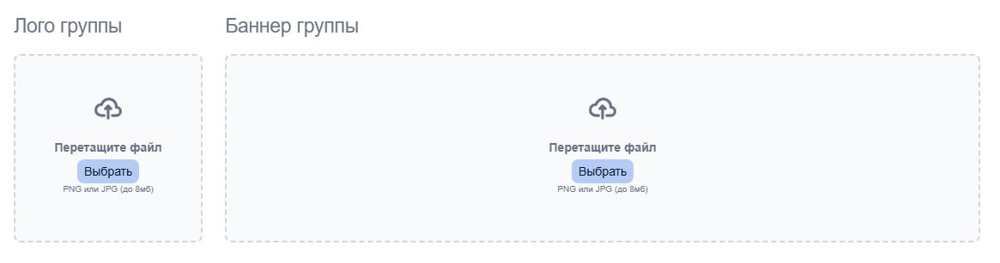
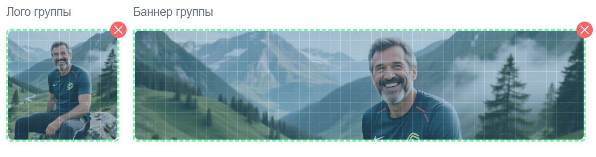

# Загрузчик файлов (DnDFilesImage)

React-компонент для загрузки изображений с поддержкой **Drag and Drop** и выбора через диалог. Ограничения по размеру и типу файлов задаются через пропсы.

## Возможности

- Загрузка файла перетаскиванием (DnD) или кнопкой «Выбрать»
- Ограничение **максимального размера файла** (в байтах) через проп `maxSize`
- Проверка типа: только **JPEG** и **PNG**
- Предпросмотр изображения с возможностью **перемещения** для настройки кадрирования
- Кэширование данных для восстановления при повторном рендере
- Передача данных в родительский компонент через callback и через `ref`
- Визуальные состояния блока: ожидание, перетаскивание, успех, ошибка

## Визуальные примеры





## Пропсы

| Проп | Тип | По умолчанию | Описание |
|------|-----|--------------|----------|
| `name` | `string` | — | **Обязательный.** Уникальное имя поля (нужно при нескольких экземплярах компонента). |
| `maxSize` | `number` | `8000000` (8 МБ) | Максимальный размер файла в байтах. |
| `width` | `number` | — | Ширина блока дропа (опционально). |
| `height` | `number` | — | Высота блока дропа (опционально). |
| `icon` | `ReactNode` | иконка загрузки | Иконка в пустом блоке дропа. |
| `label` | `string` | `false` | Подпись под кнопкой выбора файла. |
| `classes` | `string` | `'w-48 h-48'` | CSS-классы контейнера блока дропа. |
| `action` | `any` | `false` | Идентификатор действия для callback при отправке данных. |
| `cache` | `boolean` | `false` | Включает формирование кэша для передачи при ререндере. |
| `cacheDataFile` | `object` | `false` | Кэшированные данные файла для автоматического отображения при повторном рендере. |
| `file` | `File` | `false` | Объект `File` для программной загрузки в компонент. |
| `store` | `string` | — | Каталог загрузки (передаётся в форме). |
| `component` | `string` | `'N'` | Имя компонента для удалённого запроса. |
| `handleDnDFiles` | `(action, data) => void` | — | Обработчик в родителе: вызывается при отправке или очистке данных. |
| `develop` | `boolean` | `false` | Режим разработки (опционально). |

## Ref

Компонент обёрнут в `forwardRef`. Через ref доступен метод:

- **`uploadFormData({ clear?: boolean })`** — отправить данные в родитель (`handleDnDFiles`) или очистить блок (`clear: true`).

## Пример использования

```jsx
import DnDFilesImage from './DnDFilesImage';

function MyForm() {
    const uploadRef = useRef();

    const handleDnDFiles = (action, data) => {
        if (data === 'N') {
            // Файл сброшен
            return;
        }
        // data.form — объект с file, store, component, размеры, dropData, cache и т.д.
        console.log(action, data.form);
    };

    return (
        <DnDFilesImage
            name="avatar"
            maxSize={5 * 1024 * 1024}
            width={200}
            height={200}
            label="До 5 МБ, jpg/png"
            store="avatars"
            component="UserAvatar"
            action="avatar"
            handleDnDFiles={handleDnDFiles}
            ref={uploadRef}
        />
    );
}
```

## Ограничения по размеру

- **`maxSize`** задаётся в **байтах** (например, `5 * 1024 * 1024` для 5 МБ).
- При превышении размера показывается сообщение об ошибке и блок переходит в состояние `drop-error`.

## Поддерживаемые форматы

- `image/jpeg`, `image/pjpeg`, `image/png`  
В интерфейсе: `.jpg`, `.jpeg`, `.png`.

## Зависимости

- Иконки: `@/Administrator/Components/Icons/Icons` (`upload`, `plus`)

