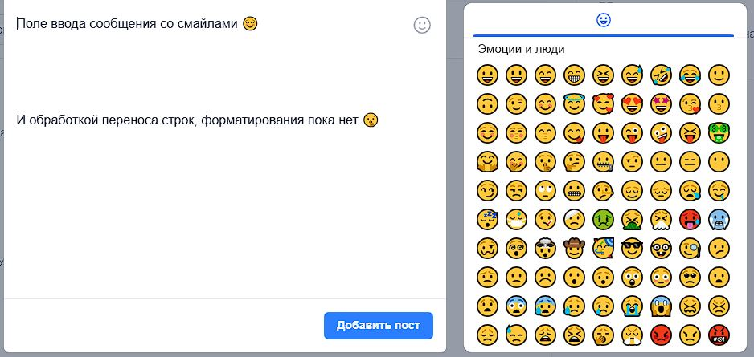

# Поле ввода сообщения со смайлами (UFMessageInput)

React-компонент для ввода текстовых сообщений с поддержкой **эмодзи** и расширенными возможностями редактирования.

## Визуальная демонстрация



## Возможности

- **ContentEditable** — редактируемое поле ввода с поддержкой многострочного текста
- **Вставка эмодзи** — выбор и вставка смайлов через удобный пикер
- **Ограничение длины** — автоматическая обрезка текста при превышении лимита
- **Обработка Enter** — настраиваемое поведение при нажатии Enter (отправка или перенос строки)
- **Безопасный ввод** — очистка и валидация текста через библиотеку UF
- **Автофокус** — автоматическая установка фокуса при монтировании
- **Ref API** — методы для программного управления компонентом
- **Вставка из буфера** — обработка вставки текста с очисткой
- **Адаптивная высота** — автоматическое изменение высоты с ограничением максимума
- **Поддержка темной темы**

## Пропсы

| Проп | Тип | По умолчанию | Описание |
|------|-----|--------------|----------|
| `value` | `string` | `''` | Значение поля ввода. |
| `placeholder` | `string` | `'Введите сообщение...'` | Текст плейсхолдера. |
| `maxHeight` | `number` | `200` | Максимальная высота поля в пикселях. |
| `onChange` | `(text: string) => void` | — | Callback при изменении текста. |
| `onSend` | `(text: string) => void` | — | Callback при отправке сообщения (Enter). |
| `disabled` | `boolean` | `false` | Отключение редактирования. |
| `maxLength` | `number` | `5000` | Максимальная длина текста. |
| `enterBehavior` | `'send' \| 'newline'` | `'send'` | Поведение при нажатии Enter:<br/>- `'send'` — отправка (Shift+Enter для новой строки)<br/>- `'newline'` — новая строка (Shift+Enter для отправки). |
| `autoFocus` | `boolean` | `false` | Автоматическая установка фокуса. |
| `emoji` | `boolean` | `false` | Показывать кнопку выбора эмодзи. |
| `className` | `string` | `''` | Дополнительные CSS-классы. |

## Ref методы

Компонент обёрнут в `forwardRef`. Через ref доступны методы:

- **`getValue()`** — получить текущий текст поля
- **`setValue(text: string)`** — установить значение поля
- **`clear()`** — очистить поле
- **`focus()`** — установить фокус на поле

## Пример использования

```jsx
import UFMessageInput from './InputMessage';
import { useRef } from 'react';

function ChatInput() {
    const inputRef = useRef();

    const handleSend = (text) => {
        console.log('Отправка:', text);
        // Отправка сообщения на сервер
        inputRef.current?.clear();
    };

    const handleChange = (text) => {
        console.log('Изменение:', text);
    };

    return (
        <div className="relative">
            <UFMessageInput
                ref={inputRef}
                placeholder="Введите сообщение..."
                maxHeight={150}
                maxLength={1000}
                enterBehavior="send"
                emoji={true}
                autoFocus={true}
                onChange={handleChange}
                onSend={handleSend}
            />
        </div>
    );
}
```

## Поведение Enter

### `enterBehavior="send"` (по умолчанию)
- **Enter** — отправка сообщения
- **Shift+Enter** — новая строка

### `enterBehavior="newline"`
- **Enter** — новая строка
- **Shift+Enter** — отправка сообщения

## Эмодзи пикер

При включении `emoji={true}` отображается кнопка со смайлом, при клике открывается пикер эмодзи с настройками:
- **Локаль:** русский (`ru`)
- **Категории:** только люди (`people`)
- **Превью:** отключено
- **Тон кожи:** отключено
- **Поиск:** отключено

## Зависимости

### Основные библиотеки

- **`react`** — базовый фреймворк
- **`@emoji-mart/react`** — библиотека для выбора эмодзи

### Установка библиотеки эмодзи

```bash
npm install @emoji-mart/react
```

Или через yarn:

```bash
yarn add @emoji-mart/react
```

### Дополнительные зависимости

- **UF библиотека** — для работы с текстом (`UF.getSecureText`, `UF.getContentEditableNode`)
- **Иконки** — компонент `smile` из `@/Administrator/Components/Icons/Icons`

## Особенности реализации

### ContentEditable
Компонент использует `contentEditable` вместо обычного `textarea` для более гибкого управления текстом и поддержки эмодзи.

### Безопасность
Все вводимые данные проходят через `UF.getSecureText()` для очистки и валидации.

### Управление курсором
После вставки эмодзи или обрезки текста курсор автоматически устанавливается в правильную позицию.

### Обработка вставки
При вставке текста из буфера обмена выполняется очистка и валидация через `UF.getSecureText()`.
