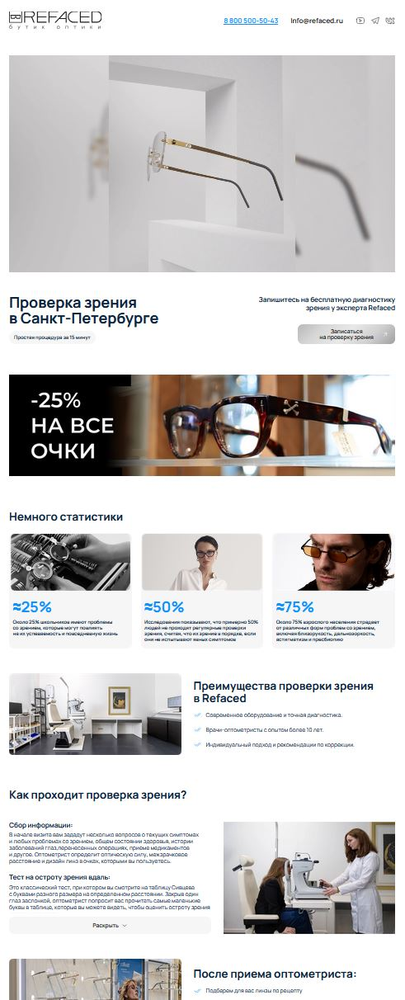
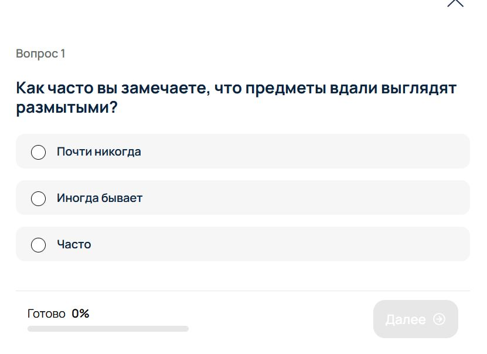
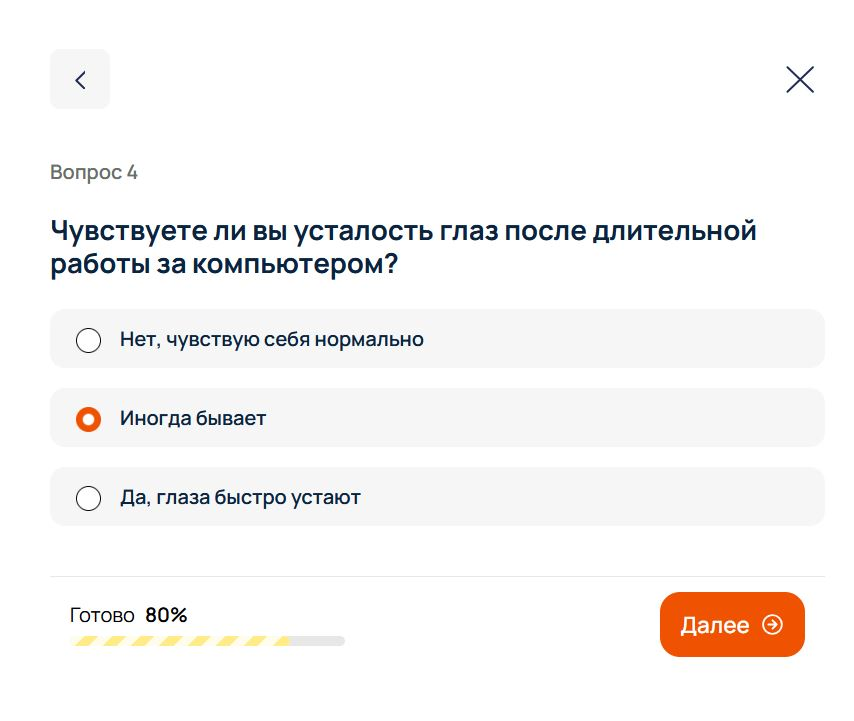
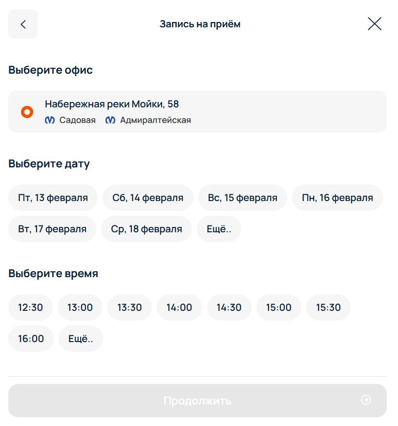

## Лендинг проверки зрения и записи на приём (Bitrix)

Лендинг рассказывает о проверке зрения в REFACED и ведёт пользователя через **квиз из 5 вопросов о состоянии зрения** к **онлайн‑записи на приём к оптометристу**. Визуальный контент и блоки преимуществ убеждают пройти диагностику, квиз помогает вовлечь пользователя и собрать первичную информацию, а встроенная форма записи с выбором офиса, даты и времени создаёт удобный путь от интереса до визита в один сценарий.

### Основная идея работы

- **Публичная страница** (`public/index.php`) подключает компонент `refaced:vision.landing`.
- **Компонент `vision.landing`** (`component/vision.landing`) в базовом шаблоне `.default`:
  - собирает HTML‑каркас страницы (head, body, метрика, контейнеры прокрутки);
  - внутри подключает тот же компонент `refaced:vision.landing` с шаблонами:
    - `navbar` — верхнее меню / шапка лендинга,
    - `content` — основной контент лендинга и блок запуска квиза,
    - `footer` — нижняя часть страницы.
- **Шаблон `content`** отвечает за весь промо‑контент лендинга: баннеры, преимущества, описание процесса проверки зрения, офферы, отзывы, блоки офисов и FAQ, а также за **запуск квиза и записи** через кнопки с атрибутами `data-event="signup"`.
- **Шаблон `side.panel.kviz`** реализует выезжающую боковую панель с квизом:
  - пошаговые вопросы о жалобах на зрение и привычках;
  - расчёт и показ результата (2 варианта итогового экрана);
  - встроенный блок выбора офиса, даты и времени;
  - форма с контактами и согласием на обработку данных;
  - подтверждение успешной записи и возможность добавить событие в календарь.
- **Ajax‑контроллер** (`component/vision.landing/ajax.php`) отдаёт HTML квиза (`getComponent`) и обрабатывает действия:
  - `sendMailRecording` — формирует и отправляет email/лид с ответами квиза и выбранной датой;
  - `addRecording` — создаёт элемент в инфоблоке записей на приём.

### Структура файлов

- **`public/index.php`**
  - Подключает `prolog_before.php` и настраивает SEO:
    - `SetTitle("Проверка зрения")`,
    - `SetPageProperty("description", ...)`,
    - `SetPageProperty("title", ...)`.
  - Включает компонент:
    - `refaced:vision.landing` с шаблоном по умолчанию,
    - передаёт в параметр `PARAMS` весь `$_REQUEST` (можно использовать для аналитики и логики внутри компонента).

- **`component/vision.landing/component.php`**
  - Общая точка входа компонента:
    - определяет текущий шаблон (`$this->__templateName`);
    - если используется шаблон `side.panel.kviz`, то:
      - рассчитывает массив дат на 30 дней вперёд (`DATES_CALENDAR`),
      - рассчитывает массив тайм‑слотов с 11:00 до 20:30 (`TIMES_CALENDAR`) с пометкой уже прошедших времён (`BACK = 'Y'`),
      - сохраняет эти данные в `$arResult` для использования в шаблоне квиза (календарь записи).
  - После подготовки данных вызывает `$this->includeComponentTemplate()`.

- **`component/vision.landing/templates/.default/template.php`**
  - Базовый шаблон лендинга:
    - выводит `<head>` с метатегами, шрифтами (`Manrope`) и подключает сторонние библиотеки:
      - Owl Carousel, ScrollMagic, smooth‑scrollbar, jQuery UI, маски ввода, `imask`, add‑to‑calendar‑button;
    - инициализирует Bitrix UI‑расширения (`ui.forms`, `ui.buttons` и т.п.).
  - В `<body>`:
    - подключает Yandex.Metrika;
    - рендерит панель администратора Bitrix (`ShowPanel`);
    - оборачивает всё в контейнеры `scroll_bar_block` / `main_container`.
    - Внутри `container_content` последовательно включает:
      - навбар: `refaced:vision.landing` с шаблоном `navbar`;
      - контент: `refaced:vision.landing` с шаблоном `content`;
      - футер: `refaced:vision.landing` с шаблоном `footer`.
    - Пробрасывает `landRequest` в JS: `const landRequest = { ...$arParams['PARAMS'] }`.

- **`templates/content/template.php`**
  - Отвечает за весь основной лендинговый контент:
    - **верхний баннер** с десктопной и мобильной картинкой, акцентом «Четкое зрение — важнее, чем кажется»;
    - **hero‑блок**:
      - заголовок `Проверка зрения в Санкт-Петербурге`,
      - подзаголовок «Простая процедура за 15 минут»,
      - оффер «Запишитесь на бесплатную диагностику…» и кнопка `Записаться на проверку зрения` (`data-event="signup" data-data="recording"`).
    - **блок статистики** с каруселью фактов о проблемах со зрением (Owl Carousel).
    - **блок преимуществ** проверки зрения в Refaced: современное оборудование, опытные оптометристы, индивидуальный подход.
    - **подробный блок «Как проходит проверка зрения?»** с пошаговым описанием:
      - сбор информации,
      - тесты на остроту зрения вдаль и вблизи,
      - рефракционный тест,
      - подбор очковой коррекции,
      - рекомендации по линзам.
    - **блок «После приёма оптометриста»** — что происходит после обследования (подбор линз/оправ, выдача и сохранение результатов).
    - **блок с квизом**:
      - левая часть: приглашение «Пройдите опрос из 5 вопросов о здоровье ваших глаз», кнопка `Проверить зрение` (`data-event="signup" data-data="kviz"`), запускающая квиз в боковой панели;
      - правая часть: оффер скидки 10% на линзы/оправы после проверки и кнопка `Записаться на проверку` без прохождения теста.
    - **отзывы клиентов** через виджет Яндекс.Карт.
    - **каталог товаров** (если есть заранее подобранные товары через `selection_items`):
      - подключает `bitrix:catalog.section` с собственным шаблоном `catalog_landing` и фильтром `arLandFilter`.
    - **офисы в Санкт-Петербурге**:
      - два блока `bitrix:news.detail` с шаблоном `shop_landing` по элементам инфоблока офисов (`IBLOCK_ID = 11`).
    - **FAQ (часто задаваемые вопросы)** с аккордеоном: подготовка к проверке, возможность прийти без записи, расшифровка рецепта, частота проверки, признаки ухудшения зрения, готовые очки и т.п.

- **`templates/side.panel.kviz/template.php`**
  - Реализует интерфейс квиза и записи в выезжающей боковой панели:
    - генерирует уникальные ID для всех блоков квиза (`$blocks`) и использует их для связи с JS‑классом `KvizHandler`.
  - Состоит из нескольких логических частей:
    - **Шаги вопросов (5 штук)**:
      - каждый блок `.kviz_question` с номером, текстом вопроса и набором radio‑ответов:
        1. Размытость предметов вдали.
        2. Размытость предметов вблизи.
        3. Проблемы с различением цветов.
        4. Усталость глаз после работы за компьютером.
        5. Когда последний раз проверяли зрение.
      - нижняя панель с прогресс‑баром (процент готовности, шкала) и кнопкой `Далее`.
    - **Результаты квиза** (`.kviz_question_result`):
      - минимум два сценария (`data-res="1"` и `data-res="2"`) с разными текстами:
        - «Ваше зрение, похоже, в отличном состоянии»;
        - «Ваше зрение заслуживает внимания».
      - в обоих случаях:
        - кнопка `Записаться на прием` (открывает блок выбора даты/времени),
        - напоминание о скидке 10% после проверки,
        - кнопка перехода в Telegram и в каталог.
    - **Блок записи (выбор офиса, даты и времени)**:
      - выбор офиса через `bitrix:news.list` (`offices_tizer`, инфоблок `content`, ID 11, фильтр по нужному офису);
      - выбор даты:
        - первые 6 ближайших дат из `DATES_CALENDAR`,
        - кнопка «Ещё..» для подгрузки следующих дат.
      - выбор времени:
        - первые актуальные слоты из `TIMES_CALENDAR` (не прошедшие),
        - кнопка «Ещё..» для дополнительной подгрузки.
      - кнопка `Продолжить` (переход к форме данных пользователя).
    - **Форма данных пользователя**:
      - поля: имя, телефон, комментарий;
      - чекбокс согласия с политикой конфиденциальности;
      - кнопка `Продолжить` с отображением выбранной даты/времени.
    - **Результаты записи**:
      - успешный экран: «Вы успешно записались на прием», данные офиса, даты и времени, кнопка «Добавить запись в календарь», ссылки на Telegram и каталог;
      - экран ошибки: сообщение «Что-то пошло не так» и кнопка «Обновить страницу».
  - Внизу инициализирует JS‑класс:
    - `new KvizHandler({ blocks, dates, times, type })`, где `dates` и `times` — данные из `component.php`, а `type` — тип (например, откуда запущен квиз).

- **`templates/*/style.css` и `templates/*/script.js`**
  - `templates/content/style.css` / `script.js`:
    - оформление всех лендинговых блоков (баннеры, карточки статистики, двухколоночные секции, адаптив).
    - анимации появления (`digit‑t‑*`, sticky‑элементы, поведение кнопок `ld-button`, слайдеры Owl Carousel и т.д.).
  - `templates/side.panel.kviz/style.css` / `script.js`:
    - стилизация боковой панели квиза, прогресс‑бара, карточек ответов, календаря.
    - JS‑логика:
      - открытие/закрытие панели по кликам на кнопки `data-event="signup"`,
      - переход между вопросами,
      - формирование результата,
      - сбор и отправка формы (через контроллер `VisionLandingAjaxController`).
  - `templates/navbar` и `templates/footer`:
    - оформляют навигацию и футер лендинга в едином стилистическом стиле сайта.

- **`component/vision.landing/ajax.php` (контроллер `VisionLandingAjaxController`)**
  - Экшены:
    - `getComponentAction($type)` — возвращает компонент `refaced:vision.landing` с шаблоном `side.panel.kviz` и параметром `TYPE`, чтобы подгрузить квиз по ajax.
    - `sendMailRecordingAction($form)`:
      - собирает комментарий для лида (дата, комментарий пользователя, ответы на вопросы);
      - формирует HTML‑таблицу с ответами для включения в письмо;
      - отправляет данные в Bitrix24 (через `VladClasses\CRest::call('crm.lead.add', ...)`);
      - создаёт письмо/событие `SEND_RECORDING` через `CEvent::Send` с полями:
        - имя, телефон, комментарий, дата записи, выбранный офис, таблица ответов и статус создания лида.
    - `addRecordingAction($form)`:
      - парсит массив полей формы (`L_NAME`, `L_TEL`, `L_DATETIME`);
      - создаёт элемент в инфоблоке `ID = 27` с этими свойствами (новая запись на конкретную дату);
      - возвращает JSON‑ответ с флагом `error` и сообщением/ID записи.

### Краткий сценарий работы пользователя

1. Пользователь попадает на страницу `public/index.php`, видит лендинг с описанием проверки зрения, преимуществами, блоком «Как проходит проверка», оффером скидки 10% и отзывами.
2. Пользователь либо:
   - запускает **квиз** (кнопка «Проверить зрение»), отвечает на 5 вопросов и получает персонализированный результат, либо
   - сразу нажимает `Записаться на проверку` и переходит к записи без теста.
3. В боковой панели квиза пользователь выбирает офис, дату и время приёма, затем заполняет свои данные (имя, телефон, комментарий) и подтверждает согласие на обработку данных.
4. После отправки формы:
   - создаётся запись в инфоблоке и лид в Bitrix24 с ответами квиза и данными пользователя,
   - пользователю показывается экран успешной записи с возможностью добавить событие в календарь и перейти в каталог.

### Скриншоты лендинга и квиза

- **Общий вид лендинга проверки зрения**

  

- **Квиз — вопросы о состоянии зрения и симптомах**

  

- **Квиз — результат и предложение записаться на приём**

  

- **Боковая панель записи: выбор офиса, даты и времени**

  

- **Форма записи: ввод контактов и подтверждение записи**

  

