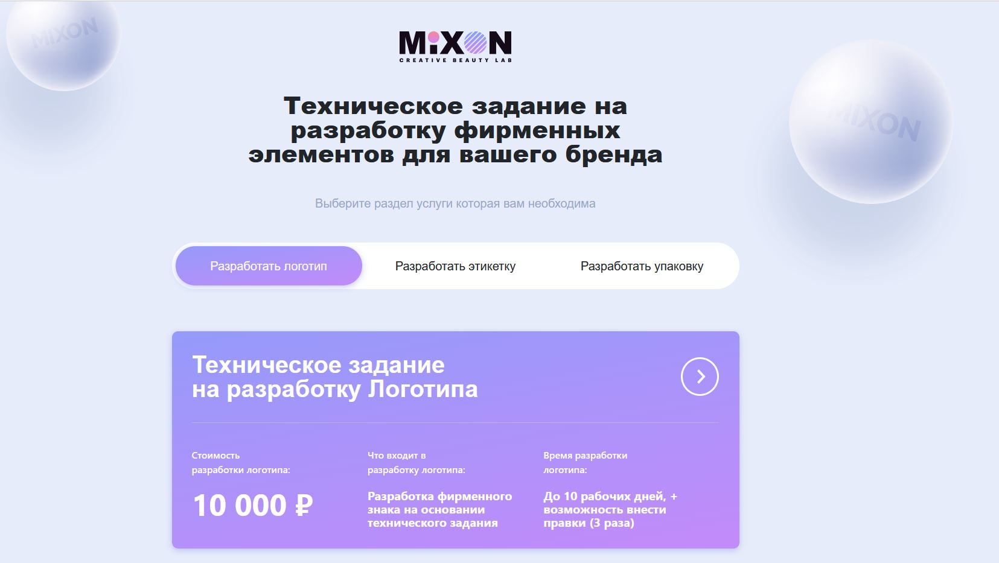
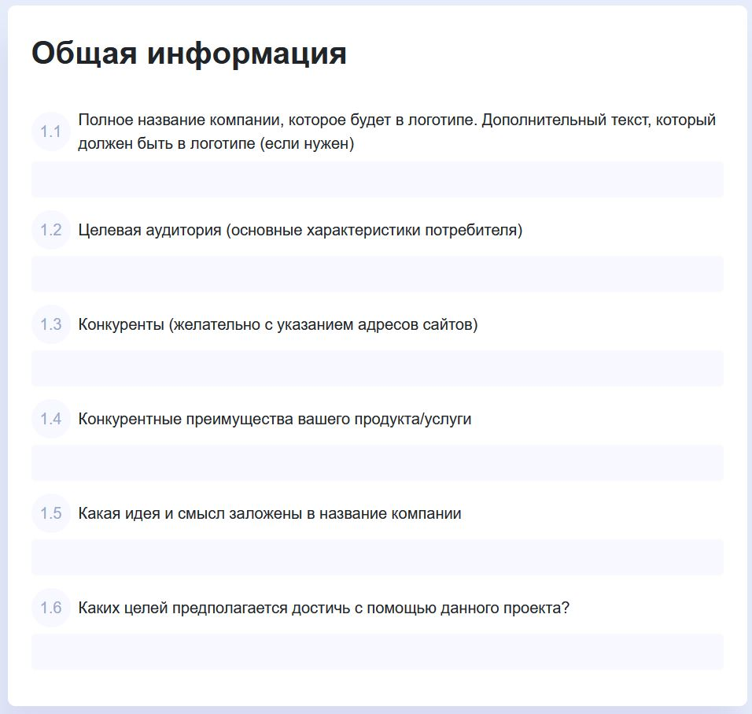
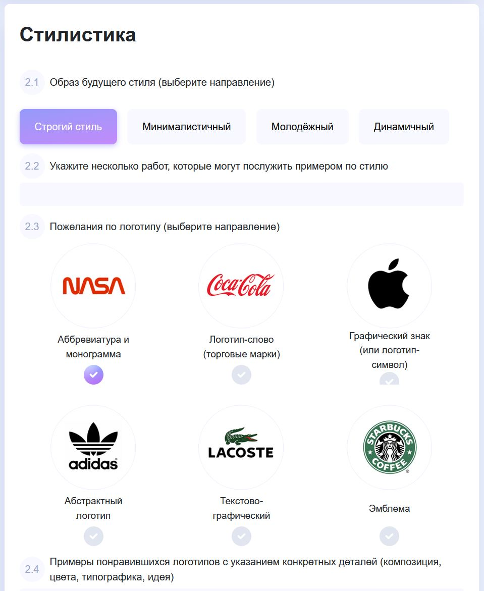
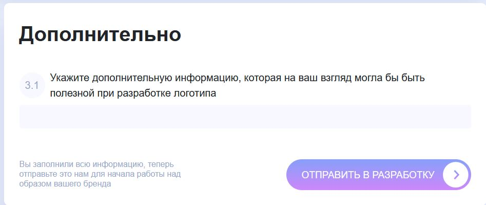

## Форма контрактного производства (лендинг Bitrix)

Функциональный лендинг с формой сбора технического задания для **контрактного производства препаратов для наращивания ресниц и сопутствующей продукции** под брендом заказчика. Страница позволяет онлайн собрать подробный бриф: от общей информации о бренде и целевой аудитории до пожеланий по логотипу, этикетке и упаковке. На основе отправленной формы менеджеры получают структурированное ТЗ для индивидуальной разработки продукта и фирменного стиля.

### Основная идея работы

- **Публичная страница** (`public/private_design.php`) разворачивает отдельный лендинг без стандартного site‑шаблона (через `prolog_before.php`), подключая только нужные стили/скрипты и блок с формами.
- **Главный блок лендинга** (`include/mix_private_design.php`) выводит:
  - шапку с логотипом MIXON и описанием услуги;
  - переключатель разделов услуги (логотип, этикетка, упаковка);
  - соответствующую форму‑бриф (через вложенные include‑формы).
- **Формы‑брифы** (`include/forms/*.php`) реализуют многостраничное ТЗ с полями, радиокнопками и подсказками, которые шаг за шагом собирают данные о бренде, продукте и ожиданиях клиента.
- **Форма обратной связи** (`include/forms/form_feedback.php` + компонент `form_feedback` в `contract_manufacturing.php`) собирает контактные данные и согласие на обработку персональных данных, чтобы менеджер мог связаться с заказчиком и обсудить детали.

### Структура файлов

- **`public/private_design.php`**
  - Подключает `prolog_before.php`, язык файла и базовые модули Bitrix (`CJSCore::Init`).
  - Подготавливает `<head>`:
    - подключает шрифты, CSS шаблона (`colors.css`, `bootstrap.min.css`, `custom.css` и др.);
    - подключает JS (`bootstrap.min.js`, `formValidation.min.js`, `inputmask.min.js`, `scrollbar`, `main.js`);
    - выводит счётчики, meta‑теги и тайтл.
  - Через компонент `bitrix:main.include` с шаблоном `form_private_design` подключает основной блок лендинга:
    - `PATH => SITE_DIR."include/mix_private_design.php"`.

- **`include/mix_private_design.php`**
  - Формирует «каркас» лендинга с выбором типа услуги:
    - заголовок: «Техническое задание на разработку фирменных элементов для вашего бренда»;
    - подзаголовок: «Выберите раздел услуги которая вам необходима»;
    - верхнее меню с табами:
      - `Разработать логотип` (`data-form="__LOGO"`),
      - `Разработать этикетку` (`data-form="__ETIC"`),
      - `Разработать упаковку` (`data-form="__UPACK"`).
  - Отображает инфоблок с краткой информацией о выбранной услуге (стоимость, что входит, сроки).
  - Через `bitrix:main.include` с шаблоном `block_form` последовательно подключает три формы‑брифа:
    - `include/forms/private-design__logo.php` — активная форма по умолчанию (`FORM="__LOGO"`, `ACTIVE="Y"`);
    - `include/forms/private-design__etic.php` — форма для этикетки (`FORM="__ETIC"`, `ACTIVE="N"`);
    - `include/forms/private-design__upack.php` — форма для упаковки (`FORM="__UPACK"`, `ACTIVE="N"`).
  - Переключение вкладок и форм (по `data-form`) реализуется на JS‑уровне шаблона сайта.

- **`include/forms/private-design__logo.php`**
  - Многошаговая форма‑бриф **на разработку логотипа**:
    - скрытое поле `NAME_FORM` c названием ТЗ.
    - **Блок «Общая информация»**:
      - название компании,
      - целевая аудитория,
      - конкуренты,
      - конкурентные преимущества,
      - идея и смысл названия,
      - цели проекта.
    - **Блок «Стилистика»**:
      - выбор образа будущего стиля (строгий, минималистичный, молодёжный, динамичный);
      - примеры работ по стилю;
      - тип логотипа (монограмма, логотип‑слово, графический знак, абстрактный, текстово‑графический, эмблема) с иконками;
      - пожелания по цветовой гамме и элементы, которых нужно избегать.
    - **Блок «Дополнительно»**:
      - дополнительная информация, важная для работы дизайнера.
    - Кнопка отправки `Отправить в разработку` (`#mix-pr-submit__logo`, `data-form="__LOGO"`) отправляет заполненное ТЗ менеджерам.

- **`include/forms/private-design__etic.php`**
  - Форма‑бриф **на разработку этикетки**:
    - `NAME_FORM = "Техническое задание на разработку Этикетки"`.
    - **Общая информация**:
      - товар, для которого создаётся этикетка;
      - ценовая группа (Low‑priced / Middle‑priced / Luxury);
      - виды/ароматы, объёмы (гр/мл).
    - **Рынок**:
      - основные конкуренты,
      - позиционирование относительно конкурентов,
      - окружение на полке,
      - примеры этикеток, которые нравятся / не нравятся.
    - **Целевая аудитория**:
      - описание ЦА и типичного представителя.
    - **Стиль этикетки / приоритеты объектов**:
      - на чём сделать акцент (аромат, полезность, цена, уникальность и т.д.);
      - приоритеты элементов (марка, название, логотип, фото продукта, иллюстрация).
    - **Дополнительно**:
      - свободное поле для любых дополнительных пожеланий.
    - Кнопка `Отправить в разработку` (`#mix-pr-submit__etic`, `data-form="__ETIC"`).

- **`include/forms/private-design__upack.php`**
  - Форма‑бриф **на разработку упаковки** (по структуре близка к этикетке):
    - `NAME_FORM = "Техническое задание на разработку Упаковки"`.
    - **Общая информация**:
      - для какого товара создаётся упаковка;
      - ценовая группа (Low‑priced / Middle‑priced / Luxury);
      - виды, ароматы, объёмы.
    - **Рынок**:
      - конкуренты,
      - желаемое позиционирование упаковки относительно конкурентов,
      - соседи по полке,
      - примеры упаковок, близких/неблизких по стилю.
    - **Целевая аудитория**:
      - подробное описание ЦА.
    - **Стиль упаковки / приоритеты объектов**:
      - акценты в дизайне;
      - приоритеты элементов (марка, название, логотип, фото продукта, иллюстрация).
    - **Дополнительно**:
      - поле для любой важной информации.
    - Кнопка `Отправить в разработку` (`#mix-pr-submit__upack`, `data-form="__UPACK"`).

- **`include/forms/form_feedback.php`**
  - Универсальный блок **контактной формы** с параметрами:
    - `TITTLE` — заголовок блока (например, «Начать сотрудничество легко!»);
    - `BUTTON_NAME` — текст на кнопке отправки;
    - `BORDER`, `P_ABSOLUTE`, `DISABLE` — визуальные/поведенческие параметры.
  - Поля формы:
    - имя, телефон, email;
    - чекбокс согласия на обработку персональных данных (по умолчанию включён).
  - Кнопка отправки идентифицируется через `$itemIds['BUTTON_ID']` и используется в JS для отправки данных на сервер.

- **`include/contract_manufacturing.php`**
  - Контентный блок лендинга, описывающий услугу **контрактного производства**:
    - преимущества работы с MIXON;
    - примеры продукции (клей, уходовая косметика, средства для ламинирования, пинцеты, средства для окрашивания бровей);
    - этапы производства (от первичной консультации и брифа до производства и сопровождения);
    - финальный блок с посланием бренда.
  - В самом конце подключает компонент `form_feedback` с параметрами:
    - заголовок «Начать сотрудничество легко!»;
    - кнопка «Отправить»;
    - включённая рамка и доступные поля.

### Краткий сценарий работы пользователя

1. Заказчик переходит на страницу `public/private_design.php`, видит лендинг контрактного производства и блок выбора услуги по разработке фирменных элементов (логотип, этикетка, упаковка).
2. Пользователь выбирает нужный раздел и последовательно заполняет поля брифа: описывает бренд, продукты, целевую аудиторию, рыночное окружение, стиль и пожелания к дизайну.
3. После заполнения формы нажимает кнопку «Отправить в разработку» — собранное ТЗ уходит менеджерам MIXON, которые запускают процесс индивидуальной разработки.
4. В любой момент пользователь может оставить свои контактные данные в форме «Начать сотрудничество легко!», чтобы менеджер по контрактному производству связался с ним и помог оформить заказ на производство под его брендом.

### Скриншоты формы

- **Главный экран формы и выбор услуги**

  

  

  

  

